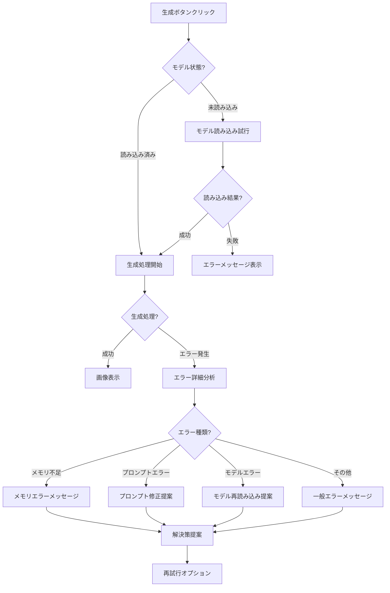

# アプリケーションフロー

このドキュメントでは、GenerativeAIArtWebアプリケーションの主要なユーザーフローと画面遷移について詳しく説明します。

## ユーザージャーニー概要

GenerativeAIArtWebを利用するユーザーの一般的なジャーニーマップは以下の通りです：


## 主要なユーザーフロー

### 1. 基本的な画像生成フロー

最も一般的なユーザーフローは、テキストプロンプトから画像を生成する基本的なプロセスです：


### 2. プロンプト生成支援フロー

ユーザーがLLMやJSONベースのプロンプト生成ツールを使用するフロー：


### 3. 画像後処理フロー

生成された画像に後処理を適用するフロー：


### 4. 設定管理フロー

ユーザー設定の保存と読み込みのフロー：


## 画面遷移

アプリケーションの主要な画面と遷移を示します：


## 主要画面の目的

各画面の主な目的と提供する機能を説明します：

### メイン画像生成画面

**目的**: プロンプト入力と画像生成パラメータの設定、生成開始

**主な機能**:
- プロンプト入力フィールド
- モデル選択ドロップダウン
- 生成パラメータ設定（ステップ数、CFGスケール、サンプラー、サイズ、シード）
- 生成ボタン
- 設定保存・読み込みオプション

### プロンプト生成画面

**目的**: 効果的なプロンプトの生成支援

**主な機能**:
- LLMベースのプロンプト生成
  - 基本プロンプト入力
  - LLMモデル選択
  - スタイル選択
  - 生成ボタン
- JSONベースのプロンプト構築
  - 被写体選択
  - スタイル選択
  - 要素選択
  - 構築ボタン
- 生成プロンプトの編集
- 画像生成タブへの適用ボタン

### 画像後処理画面

**目的**: 生成された画像の加工と保存

**主な機能**:
- アップスケールオプション
  - 解像度設定（1.5x、2x、4x）
  - アップスケールボタン
- ウォーターマークオプション
  - テキスト入力
  - 位置選択
  - 透明度設定
  - 適用ボタン
- カスタム保存オプション
  - 保存ディレクトリ選択
  - ファイル名パターン設定
  - 保存ボタン

### 設定画面

**目的**: アプリケーション設定の管理

**主な機能**:
- プリセット管理
  - 保存
  - 読み込み
  - 削除
- デフォルト値設定
- エクスポート/インポートオプション

## 分岐フロー

ユーザーの意思決定ポイントでの分岐を示します：

### プロンプト入力方法の選択


### エラー処理フロー

生成プロセス中に発生する可能性のあるエラーへの対応：



## インタラクションパターン

ユーザーとアプリケーションの主要なインタラクションパターン：

### 画像生成の進捗表示


### 設定の保存と読み込み


## エラーケースと代替フロー

### 代替フロー: モデル読み込み失敗

```mermaid
graph TD
    A[モデル読み込み開始] --> B{ファイル存在?}
    B -->|はい| C[モデル読み込み試行]
    B -->|いいえ| D[ファイル不在エラー]
    
    C --> E{メモリ十分?}
    E -->|はい| F[モデル初期化]
    E -->|いいえ| G[メモリ不足エラー]
    
    F --> H{初期化成功?}
    H -->|はい| I[モデル読み込み完了]
    H -->|いいえ| J[モデル初期化エラー]
    
    D --> K[エラー処理]
    G --> K
    J --> K
    
    K --> L{対処方法?}
    L -->|モデルパス変更| M[別モデルを選択]
    L -->|メモリ解放| N[他のアプリを閉じる]
    L -->|軽量モード| O[小さいモデルに切替]
    
    M --> P[モデル読み込み再試行]
    N --> P
    O --> P
    P --> B
    
### 代替フロー: プロンプト生成の失敗

```mermaid
graph TD
    A[LLMプロンプト生成開始] --> B{LLMの状態?}
    B -->|利用可能| C[プロンプト生成処理]
    B -->|利用不可| D[LLM利用不可エラー]
    
    C --> E{生成結果?}
    E -->|成功| F[プロンプト表示]
    E -->|失敗| G[プロンプト生成エラー]
    
    D --> H{代替手段?}
    G --> H
    
    H -->|JSONビルダー使用| I[JSONビルダーに切替]
    H -->|手動入力| J[直接プロンプト編集]
    H -->|サンプル使用| K[サンプルプロンプト選択]
    
    I --> L[代替プロンプト生成]
    J --> L
    K --> L
    
    L --> F
```

### 代替フロー: 画像生成キャンセル


## モバイル利用フロー

レスポンシブデザインによるモバイルでの利用フロー：


## データフロー概要

主要なデータがアプリケーション内でどのように流れるかを示します：


## まとめ

GenerativeAIArtWebアプリケーションのユーザーフローは、直感的な操作と効率的なワークフローを提供することを目的としています。主要な機能はタブによって整理されており、ユーザーは画像生成、プロンプト生成、後処理、設定管理といった一連のプロセスをスムーズに進めることができます。

エラーケースや代替フローも考慮されており、モデル読み込み失敗、プロンプト生成の問題、処理キャンセルなど、様々な状況に対応できるように設計されています。また、モバイル環境でもレスポンシブなUIによって快適な操作が可能です。

このアプリケーションフローは、エンドユーザーがAI画像生成の技術的な複雑さを意識することなく、クリエイティブな作業に集中できるよう設計されています。