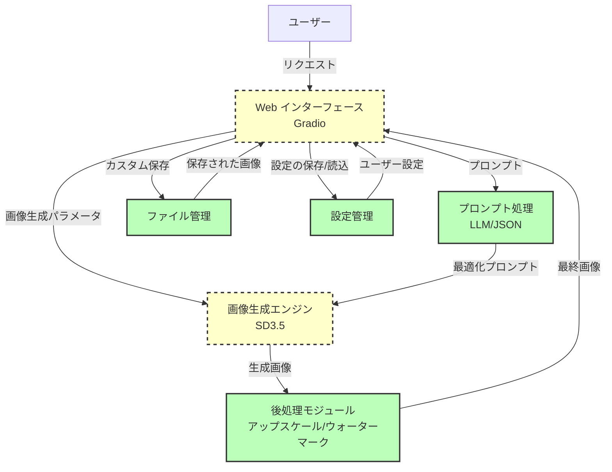
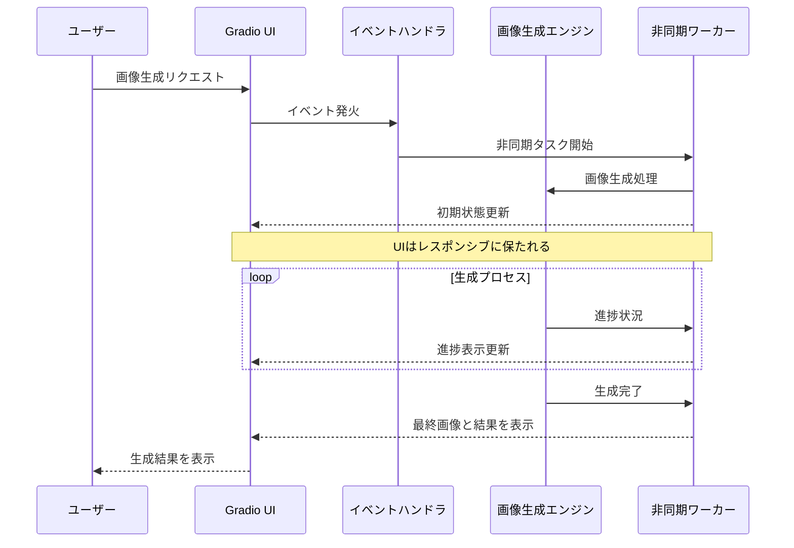
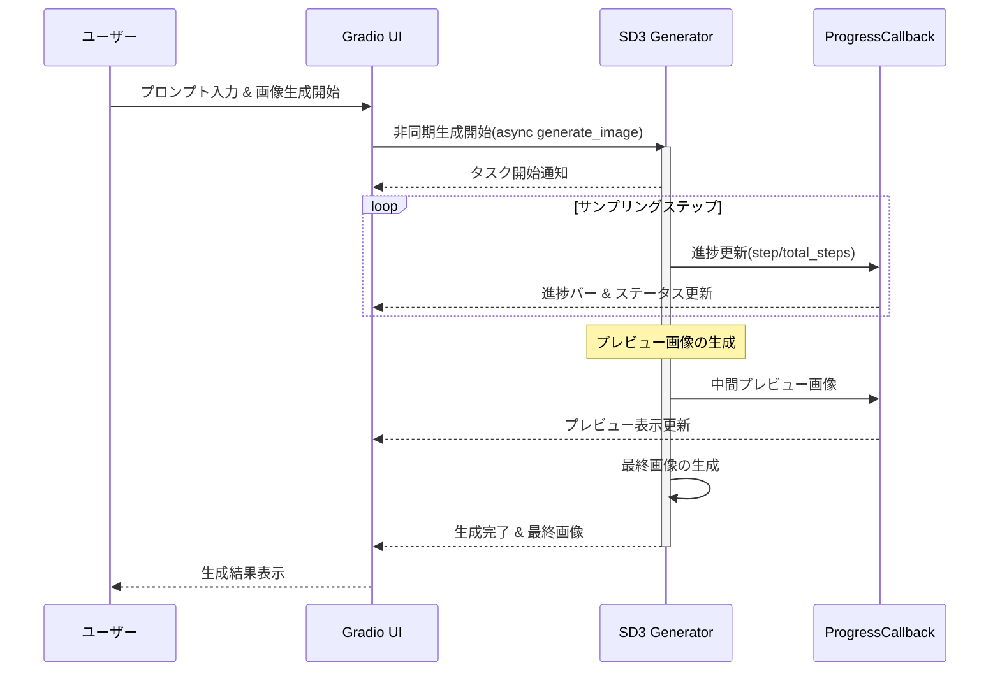

# アーキテクチャ設計

## 概要

GenerativeAIArtWebは、Stable Diffusion 3.5モデルを使用してテキストプロンプトから高品質な画像を生成するWebアプリケーションです。このドキュメントでは、システム全体のアーキテクチャと主要コンポーネントについて説明し、特に非同期処理機能に焦点を当てています。

## システムアーキテクチャ

## 非同期処理アーキテクチャ

GenerativeAIArtWebでは、非同期処理を活用してユーザーエクスペリエンスを向上させています。特に、画像生成のような時間のかかる処理を非同期で実行することで、UIの応答性を維持し、進捗状況をリアルタイムで表示できます。

## 主要コンポーネント

### 1. Web インターフェース (src/web)

非同期対応したGradioを使用したウェブインターフェースで、ユーザーが簡単に画像生成パラメータを設定し、結果を表示できます。また、進捗状況もリアルタイムで確認可能です。

#### 主な非同期機能:
- 非同期イベントハンドラによる画像生成処理
- 生成プロセスのリアルタイム進捗表示
- 長時間実行タスクのキャンセル機能
- 複数リクエストの並行処理

### 2. 画像生成エンジン (src/generator)

Stable Diffusion 3.5モデルを中心とした画像生成の中核機能を提供します。非同期対応させることで、効率的な実行が可能になります。

#### 主な構成要素:
- `SD3Inferencer`: 画像生成クラス
- `ProgressCallback`: 進捗状況を通知するコールバックインターフェース
- `StreamingOutput`: 段階的な出力結果をストリーミングするためのクラス

### 3. プロンプト処理 (src/prompt)

テキストプロンプトを最適化するための機能を提供します。LLMとJSONベースの両方のプロンプト生成メカニズムをサポートしています。

### 4. 後処理モジュール (src/utils)

生成された画像の後処理を行うユーティリティを提供します。アップスケールやウォーターマーク追加などの処理も非同期で実行可能です。

### 5. 設定管理 (src/utils)

ユーザー設定のプロファイル保存と管理を行います。

## 非同期データフロー

## 実装の詳細

### 非同期処理の実現方法

Gradioは3.50.0以降、非同期関数を直接イベントハンドラとして使用できるようになりました。これを活用して以下の機能を実装しています：

1. **非同期イベントハンドラ**: `async def` で定義された関数をGradioのイベントハンドラとして登録
2. **ストリーミング出力**: ジェネレータ関数を使用して部分的な結果を逐次的に返す
3. **進捗表示**: `gr.Progress()` コンポーネントを使用して進捗バーを表示
4. **並行処理**: `asyncio.gather()` を使用して複数のタスクを並行実行

### キャンセル機能の実装

長時間実行されるタスクをユーザーがキャンセルできるようにするため、asyncioの`CancelledError`例外を利用します。Gradioのキャンセルボタンと組み合わせることで、ユーザーがいつでも処理を中断できます。

## フォルダ構成

```mermaid
graph TD
    Root[GenerativeAIArtWeb/] --> Src[src/]
    Root --> Test[test/]
    Root --> Models[models/]
    Root --> Outputs[outputs/]

    Src --> Generator[generator/]
    Src --> Web[web/]
    Src --> Prompt[prompt/]
    Src --> Utils[utils/]
    Src --> ModelsDef[models/]

    Generator --> SD3Inf[sd3_inf.py]
    Generator --> SD3Impls[sd3_impls.py]
    Generator --> AsyncWrapper[async_wrapper.py]

    Web --> App[app.py]
    Web --> Routes[routes.py]
    Web --> Templates[templates/]
    Web --> Static[static/]

    Prompt --> LLMGen[llm_generator.py]
    Prompt --> JSONBuilder[json_builder.py]

    Utils --> Upscaler[upscaler.py]
    Utils --> FileManager[file_manager.py]
    Utils --> Watermark[watermark.py]
    Utils --> Settings[settings.py]

    ModelsDef --> Base[base.py]
    ModelsDef --> FMmodels[file_manager.py]
    ModelsDef --> SettingsModels[settings.py]
    ModelsDef --> WebModels[web.py]

    classDef coreComponents fill:#f9f,stroke:#333,stroke-width:1px;
    classDef webComponents fill:#bbf,stroke:#333,stroke-width:1px;
    classDef utilityComponents fill:#bfb,stroke:#333,stroke-width:1px;
    classDef asyncComponents fill:#ffc,stroke:#333,stroke-width:1px,stroke-dasharray: 5 5;
    
    class Generator,SD3Inf,SD3Impls coreComponents;
    class Web,App,Routes,Templates,Static webComponents;
    class Utils,Prompt,Upscaler,FileManager,Watermark,Settings,LLMGen,JSONBuilder utilityComponents;
    class AsyncWrapper asyncComponents;
```

## 技術選定

1. **Gradio 4.31.0+**: シンプルなUI構築と非同期処理のサポート
2. **Asyncio**: Pythonの標準非同期プログラミングライブラリ
3. **Pydantic v2**: 型チェックとデータバリデーションのための堅牢なフレームワーク
4. **Stable Diffusion 3.5**: 高品質な画像生成

## 設計方針と考慮事項

1. **非侵襲的な実装**: 既存コードへの影響を最小限に抑える
2. **段階的な移行**: 一度にすべてを非同期化するのではなく、重要な部分から段階的に移行
3. **ユーザーエクスペリエンスの重視**: 進捗表示やキャンセル機能でUXを向上
4. **エラーハンドリング**: 非同期処理特有のエラーに対する適切な処理
5. **拡張性**: 将来的な機能追加に対応できる柔軟な設計