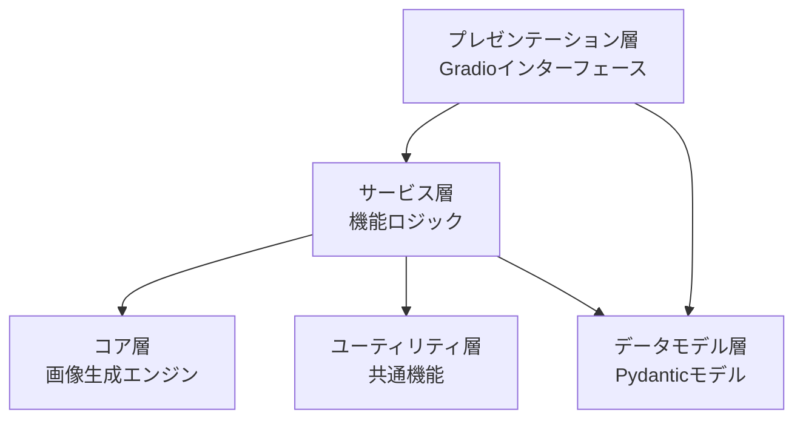
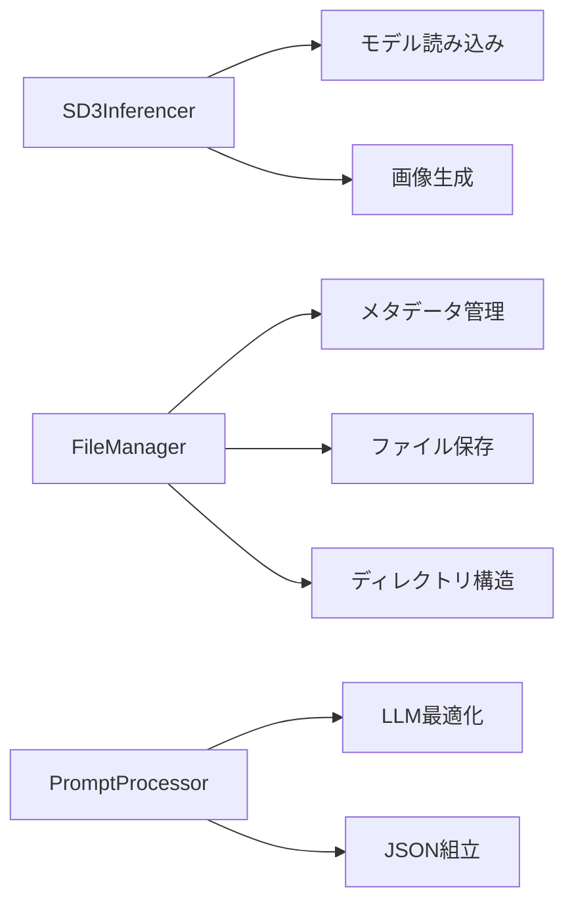
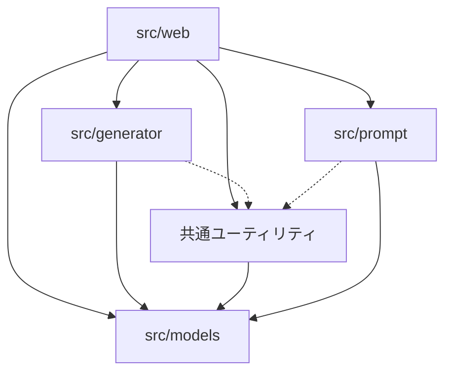

# コードガイドライン

このドキュメントでは、GenerativeAIArtWebの開発に関するコード設計とガイドラインについて説明します。Gradioベースのアプリケーションにおける設計パターン、ベストプラクティス、コード編成のガイドラインを提供します。

## 全体アーキテクチャ

GenerativeAIArtWebは以下のレイヤードアーキテクチャを採用しています：



### レイヤーの責任

1. **プレゼンテーション層**（src/web/）
   - ユーザーインターフェース
   - イベントハンドリング
   - 入力バリデーション（UI側）
   - 表示フォーマット

2. **サービス層**（各モジュールの高レベルクラス）
   - ビジネスロジック
   - コンポーネント間の連携
   - エラー処理と例外の変換

3. **コア層**（src/generator/）
   - 画像生成エンジン
   - SD3.5モデルとの連携
   - 生成アルゴリズム

4. **ユーティリティ層**（src/utils/）
   - 横断的な共通機能
   - ファイル操作
   - 画像処理

5. **データモデル層**（src/models/）
   - Pydanticモデル
   - データバリデーション
   - シリアライズ/デシリアライズ

## 設計パターン

### 1. 依存性の注入

複数のコンポーネントを組み合わせる際には依存性の注入パターンを使用します：

```python
# 良い例
class ImageGenerator:
    def __init__(self, model_loader, prompt_processor, file_manager):
        self.model_loader = model_loader
        self.prompt_processor = prompt_processor
        self.file_manager = file_manager
        
    def generate(self, prompt, params):
        processed_prompt = self.prompt_processor.process(prompt)
        image = self.model_loader.get_model().generate(processed_prompt, params)
        return self.file_manager.save_image(image)
```

```python
# 避けるべき例
class ImageGenerator:
    def __init__(self):
        self.model_loader = ModelLoader()  # 密結合
        self.prompt_processor = PromptProcessor()
        self.file_manager = FileManager()
```

### 2. 責務の分離

各クラスは単一責任の原則に従って設計します：



### 3. ファクトリーパターン

複雑なオブジェクトの生成はファクトリーパターンを使用します：

```python
class ModelFactory:
    @staticmethod
    def create_model(model_type, model_path):
        if model_type == "sd3.5":
            return SD35Model(model_path)
        elif model_type == "sd3":
            return SD3Model(model_path)
        else:
            raise ValueError(f"Unsupported model type: {model_type}")
```

### 4. 戦略パターン

異なるアルゴリズムの切り替えには戦略パターンを使用します：

```python
# サンプラー戦略のインターフェース
class SamplerStrategy:
    def sample(self, model, latent, sigmas, **kwargs):
        pass

# 具体的な戦略の実装
class EulerSampler(SamplerStrategy):
    def sample(self, model, latent, sigmas, **kwargs):
        # Euler法による実装
        pass

class DPMPPSampler(SamplerStrategy):
    def sample(self, model, latent, sigmas, **kwargs):
        # DPMPP法による実装
        pass

# 戦略を使用するコンテキスト
class SD3Generator:
    def __init__(self, sampler_strategy):
        self.sampler = sampler_strategy
    
    def generate(self, prompt, latent, sigmas, **kwargs):
        # サンプラー戦略を使用
        return self.sampler.sample(self.model, latent, sigmas, **kwargs)
```

## コード構成のガイドライン

### モジュール構成

各モジュールは以下の構成に従います：

```
モジュール/
  ├── __init__.py       # 公開APIのみをエクスポート
  ├── main_class.py     # 主要クラスの実装
  ├── helpers.py        # 内部ヘルパー関数
  ├── exceptions.py     # モジュール固有の例外
  └── constants.py      # 定数とデフォルト値
```

例（generator モジュール）:

```python
# __init__.py
from .sd3_inf import SD3Inferencer
from .exceptions import ModelLoadError, GenerationError

__all__ = ['SD3Inferencer', 'ModelLoadError', 'GenerationError']
```

### クラス設計

クラスは以下の構造に従って設計します：

```python
class ExampleClass:
    """クラスの目的と責任を説明するドキュメント文字列
    
    詳細な説明と使用方法の例...
    """
    
    # 定数
    DEFAULT_VALUE = 100
    
    def __init__(self, param1, param2=None):
        """初期化メソッド
        
        Args:
            param1: 最初のパラメータの説明
            param2: 2番目のパラメータの説明（オプション）
        """
        self.param1 = param1
        self.param2 = param2 or self.DEFAULT_VALUE
        self._private_attr = None  # プライベート属性
    
    # パブリックメソッド
    def public_method(self, arg1):
        """パブリックメソッドの説明
        
        Args:
            arg1: 引数の説明
            
        Returns:
            戻り値の説明
            
        Raises:
            ExceptionType: 例外が発生する条件
        """
        # 実装
        result = self._private_method(arg1)
        return result
    
    # プライベートメソッド
    def _private_method(self, arg1):
        """プライベートメソッドの説明（内部実装用）"""
        # 実装
        return processed_value
```

## 命名規則

### モジュール名と変数名

```python
# モジュール名: スネークケース
import file_manager
import prompt_generator

# 変数名: スネークケース、意味のある名前
model_path = "path/to/model.safetensors"
generated_image = generator.create_image(prompt)
```

### クラス名

```python
# クラス名: パスカルケース、名詞
class ImageGenerator:
    pass

class PromptProcessor:
    pass
```

### メソッド名

```python
# メソッド名: スネークケース、動詞から始める
def generate_image(self, prompt):
    pass

def process_prompt(self, text):
    pass
```

### 定数

```python
# 定数: 大文字のスネークケース
MAX_RESOLUTION = 1024
DEFAULT_STEPS = 40
MODEL_CONFIGS = {
    "sd3": {"sampler": "euler", "steps": 30},
    "sd3.5": {"sampler": "dpmpp_2m", "steps": 40}
}
```

## Gradioインターフェース設計

### コンポーネント編成

Gradioインターフェースは以下のパターンで構成します：

```python
def create_interface():
    """Gradioインターフェースを作成する"""
    
    # 1. 状態変数の定義
    state = gr.State({})
    
    # 2. インターフェース定義
    with gr.Blocks(title="アプリタイトル") as interface:
        # ヘッダー
        gr.Markdown("# アプリケーションタイトル")
        
        # メインコンポーネント
        with gr.Tabs():
            with gr.TabItem("タブ1"):
                # タブ1のコンポーネント
                pass
            
            with gr.TabItem("タブ2"):
                # タブ2のコンポーネント
                pass
        
        # 3. イベントハンドラの登録
        button.click(
            fn=event_handler,
            inputs=[input1, input2],
            outputs=[output1, output2]
        )
    
    # 4. インターフェースを返す
    return interface
```

### イベントハンドラ

イベントハンドラは独立した関数として定義し、UI要素から明確に分離します：

```python
# 良い例
def on_generate_click(prompt, steps, cfg_scale, width, height, seed):
    """生成ボタンクリック時のイベントハンドラ"""
    try:
        # 入力の検証
        if not prompt:
            return None, "プロンプトを入力してください"
        
        # 画像生成ロジック
        generator = ImageGenerator()
        image, message = generator.generate(
            prompt=prompt,
            steps=steps,
            cfg_scale=cfg_scale,
            width=width,
            height=height,
            seed=seed
        )
        
        return image, message
    except Exception as e:
        return None, f"エラーが発生しました: {str(e)}"
```

### 状態管理

状態管理には`gr.State`を使用し、グローバル変数の使用を避けます：

```python
def create_interface():
    # 状態の初期化
    model_state = gr.State(None)
    history_state = gr.State([])
    
    with gr.Blocks() as demo:
        # コンポーネント定義
        
        # モデルロードイベント
        load_btn.click(
            fn=load_model_handler,
            inputs=[model_path],
            outputs=[status, model_state]
        )
        
        # 画像生成イベント
        generate_btn.click(
            fn=generate_handler,
            inputs=[prompt, steps, model_state],
            outputs=[image_output, status, history_state]
        )
    
    return demo

def load_model_handler(model_path):
    # モデルをロードし、状態を返す
    model = SD3Inferencer(model_path)
    return "モデルを読み込みました", model

def generate_handler(prompt, steps, model_state, history=None):
    # 状態を使用して処理
    if model_state is None:
        return None, "モデルが読み込まれていません", history
    
    # 画像を生成
    image = model_state.generate_image(prompt, steps)
    
    # 履歴を更新
    history = history or []
    history.append((prompt, image))
    
    return image, "生成完了", history
```

## エラー処理

### 例外階層

モジュール固有の例外を定義し、詳細な例外階層を使用します：

```python
# 基本例外クラス
class GenerativeAIError(Exception):
    """アプリケーション全体の基本例外クラス"""
    pass

# モジュール固有の例外
class GeneratorError(GenerativeAIError):
    """ジェネレーターモジュールの基本例外"""
    pass

class ModelLoadError(GeneratorError):
    """モデル読み込み時のエラー"""
    pass

class GenerationError(GeneratorError):
    """画像生成時のエラー"""
    pass

# 使用例
try:
    model.load(model_path)
except ModelLoadError as e:
    # モデル読み込みエラーの処理
    logger.error(f"モデル読み込みエラー: {e}")
    user_friendly_message = f"モデル '{os.path.basename(model_path)}' を読み込めませんでした"
```

### エラーロギング

エラーには適切なログレベルを使用します：

```python
import logging

logger = logging.getLogger(__name__)

def process_function():
    try:
        # 処理
        logger.debug("処理を開始します")
        result = complex_operation()
        logger.info("処理が完了しました")
        return result
    except ValueError as e:
        # 想定内のエラー
        logger.warning(f"入力値が不正です: {e}")
        raise
    except Exception as e:
        # 想定外のエラー
        logger.error(f"予期せぬエラーが発生しました: {e}", exc_info=True)
        raise GenerationError(f"処理中にエラーが発生しました: {str(e)}")
```

## モジュール間の依存関係

モジュール間の依存関係を最小限に抑え、循環依存を避けます：



## 非同期処理

Gradioの非同期APIを活用するためのガイドライン：

```python
import asyncio
import gradio as gr

# 非同期イベントハンドラ
async def async_process(text, progress=gr.Progress()):
    # 進捗報告の初期化
    progress(0, desc="処理を開始します...")
    
    # 非同期処理のシミュレーション
    result = ""
    for i in range(10):
        # 実際の非同期処理
        await asyncio.sleep(0.5)
        result += f"ステップ {i+1} 完了\n"
        
        # 進捗の更新
        progress((i+1)/10, desc=f"ステップ {i+1}/10 実行中...")
    
    return result

# ストリーミング出力用の非同期ジェネレータ
async def stream_output(query):
    yield "処理を開始します..."
    
    for i in range(5):
        await asyncio.sleep(1)
        yield f"処理ステップ {i+1}/5: {query}の分析中..."
    
    yield f"最終結果: {query}の分析が完了しました！"

# インターフェースの作成
with gr.Blocks() as demo:
    text_input = gr.Textbox(label="入力")
    result_output = gr.Textbox(label="結果")
    
    gr.Button("処理開始").click(
        fn=async_process,  # 非同期関数を直接指定可能
        inputs=text_input,
        outputs=result_output
    )
```

## パフォーマンス最適化

### プロファイリングと最適化

パフォーマンス問題の特定と最適化のためのガイドライン：

1. **Pythonのプロファイラーを使用**:
```python
import cProfile
import pstats

def profile_function(func, *args, **kwargs):
    profiler = cProfile.Profile()
    profiler.enable()
    result = func(*args, **kwargs)
    profiler.disable()
    stats = pstats.Stats(profiler).sort_stats('cumtime')
    stats.print_stats(20)  # 上位20件の結果を表示
    return result

# 使用例
profile_function(generate_image, prompt, steps=50, cfg_scale=4.5)
```

2. **メモリ使用量の監視とリーク防止**:
```python
import tracemalloc

# メモリトラッキング開始
tracemalloc.start()

# 関数を実行
result = my_function()

# メモリ使用状況を表示
current, peak = tracemalloc.get_traced_memory()
print(f"現在のメモリ使用量: {current / 10**6:.1f}MB")
print(f"ピーク時のメモリ使用量: {peak / 10**6:.1f}MB")

# トップ10のメモリブロックを表示
snapshot = tracemalloc.take_snapshot()
top_stats = snapshot.statistics('lineno')
for stat in top_stats[:10]:
    print(stat)
```

3. **計算集約型の処理の最適化**:
   - PyTorchのCUDAキャッシュをクリアする: `torch.cuda.empty_cache()`
   - 大きなモデルを使用後に解放する: `del model; gc.collect()`
   - バッチ処理を活用する

## テストガイドライン

### 1. テストの基本原則

#### テストの種類と目的

1. **ユニットテスト**
   - 単一の関数やクラスの動作を検証
   - 外部依存はすべてモック化
   - テストケースは独立して実行可能

2. **統合テスト**
   - 複数のコンポーネントの連携を検証
   - 実際のコンポーネント間の相互作用をテスト
   - 外部サービスは必要に応じてモック化

3. **E2Eテスト**
   - ユーザーシナリオ全体を検証
   - 実際のUIとバックエンドの統合
   - 本番環境に近い状態でのテスト

#### テストの命名規則

```python
# 関数のテスト
def test_function_name_scenario_expected_result():
    pass

# クラスのテスト
class TestClassName:
    def test_method_name_scenario_expected_result(self):
        pass

# 非同期関数のテスト
@pytest.mark.asyncio
async def test_async_function_name_scenario_expected_result():
    pass
```

### 2. テストの実装ガイドライン

#### Arrange-Act-Assert パターン

```python
def test_image_generation_success():
    # Arrange
    generator = ImageGenerator()
    prompt = "test prompt"
    expected_size = (512, 512)
    
    # Act
    result = generator.generate(prompt)
    
    # Assert
    assert result is not None
    assert result.size == expected_size
```

#### フィクスチャの使用

```python
# conftest.py
@pytest.fixture
def sample_image():
    """テスト用画像フィクスチャ"""
    return Image.new('RGB', (512, 512))

# test_file.py
def test_image_processing(sample_image):
    processor = ImageProcessor()
    result = processor.process(sample_image)
    assert result.size == (512, 512)
```

#### パラメータ化テスト

```python
@pytest.mark.parametrize("input_size,expected_size", [
    ((512, 512), (512, 512)),
    ((768, 768), (768, 768)),
    ((1024, 1024), (1024, 1024))
])
def test_image_resize(input_size, expected_size):
    image = create_test_image(input_size)
    result = resize_image(image)
    assert result.size == expected_size
```

### 3. 非同期テストのガイドライン

#### 非同期関数のテスト

```python
@pytest.mark.asyncio
async def test_async_image_generation():
    generator = AsyncImageGenerator()
    
    async with aiohttp.ClientSession() as session:
        result = await generator.generate(
            prompt="test",
            session=session
        )
        
    assert result is not None
```

#### 非同期モックの使用

```python
@pytest.mark.asyncio
async def test_async_api_call(mocker):
    mock_response = mocker.AsyncMock()
    mock_response.json.return_value = {"status": "success"}
    
    mock_session = mocker.AsyncMock()
    mock_session.get.return_value = mock_response
    
    result = await api_call(session=mock_session)
    assert result["status"] == "success"
```

### 4. エラーケースのテスト

#### 例外のテスト

```python
def test_invalid_prompt_raises_error():
    generator = ImageGenerator()
    
    with pytest.raises(ValueError) as exc_info:
        generator.generate("")
    
    assert "Empty prompt" in str(exc_info.value)
```

#### エラー状態の検証

```python
@pytest.mark.asyncio
async def test_generation_error_handling():
    generator = AsyncImageGenerator()
    
    with pytest.raises(GenerationError) as exc_info:
        await generator.generate("invalid prompt")
    
    assert exc_info.value.error_code == "INVALID_PROMPT"
    assert exc_info.value.has_retry_option
```

### 5. テストカバレッジ

#### カバレッジ目標

- ユニットテスト: 90%以上
- 統合テスト: 70%以上
- E2Eテスト: 主要フロー網羅

#### カバレッジレポートの生成

```bash
# HTMLレポート生成
poetry run pytest --cov=src --cov-report=html

# コンソールサマリー
poetry run pytest --cov=src --cov-report=term-missing
```

### 6. テストの実行環境

#### 環境変数の設定

```python
# test_settings.py
@pytest.fixture(autouse=True)
def test_env():
    original_env = dict(os.environ)
    os.environ.update({
        "TEST_MODE": "true",
        "MODEL_PATH": "test_models/",
        "CUDA_VISIBLE_DEVICES": ""
    })
    yield
    os.environ.clear()
    os.environ.update(original_env)
```

#### テストデータの管理

```python
# conftest.py
@pytest.fixture(scope="session")
def test_data_dir(tmp_path_factory):
    data_dir = tmp_path_factory.mktemp("test_data")
    # テストデータのセットアップ
    return data_dir
```

### 7. CI/CDでのテスト実行

#### GitHub Actionsの設定

```yaml
name: Tests
on: [push, pull_request]

jobs:
  test:
    runs-on: ubuntu-latest
    steps:
      - uses: actions/checkout@v2
      - name: Set up Python
        uses: actions/setup-python@v2
        with:
          python-version: '3.11'
      
      - name: Install dependencies
        run: |
          python -m pip install poetry
          poetry install
      
      - name: Run tests
        run: |
          poetry run pytest --cov=src
          poetry run pytest tests/web/e2e/
```

### 8. テストのベストプラクティス

1. **テストの独立性**
   - 各テストは他のテストに依存しない
   - テストの実行順序は結果に影響しない
   - 共有リソースは適切にクリーンアップ

2. **テストの可読性**
   - テスト名は目的を明確に示す
   - 各テストは単一の機能をテスト
   - テストデータの意図を明確にする

3. **テストの保守性**
   - DRYよりも明確さを優先
   - フィクスチャを適切に使用
   - テストコードもレビュー対象

4. **テストのパフォーマンス**
   - 重いテストは分離して実行
   - 不要なI/Oは避ける
   - 適切なスコープのフィクスチャを使用

## まとめ

本ガイドラインに従うことで、GenerativeAIArtWebプロジェクトのコードは以下の特性を備えることができます：

1. **保守性**: 明確な構造とモジュール化により、コードの保守が容易になります
2. **テスト可能性**: 依存性の注入や適切な分離により、自動テストが容易になります
3. **拡張性**: 設計パターンの活用により、新機能の追加が容易になります
4. **可読性**: 命名規則と一貫したスタイルにより、他の開発者がコードを理解しやすくなります
5. **パフォーマンス**: 最適化ガイドラインにより、効率的な実行が可能になります

チーム全体でこれらのガイドラインに従うことで、一貫性のある高品質なコードベースを維持することができます。