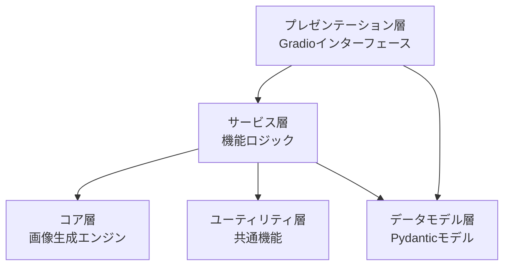
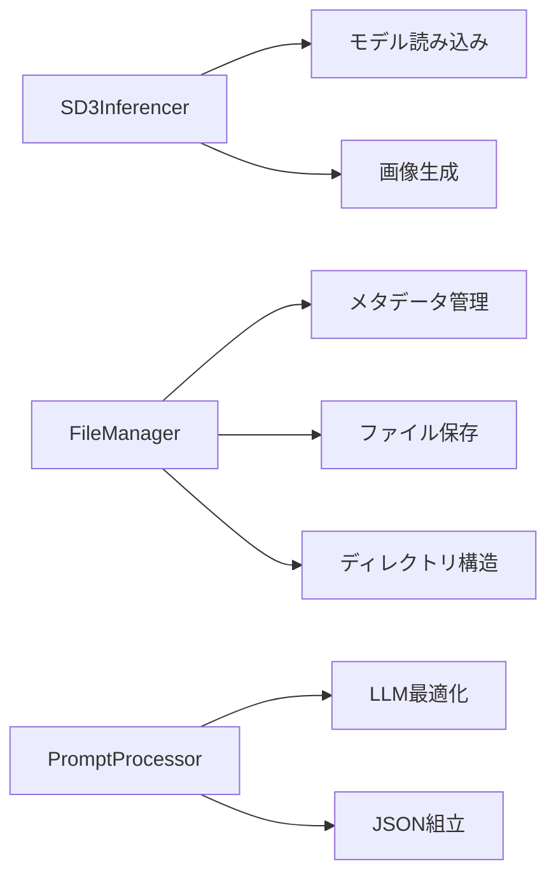
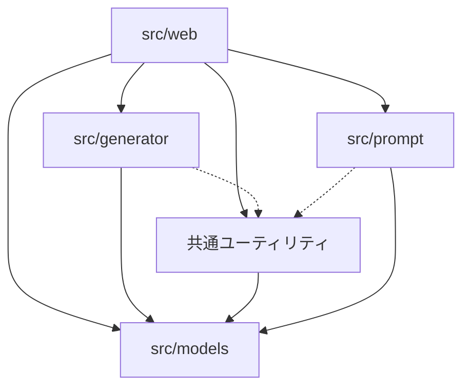

# コードガイドライン

このドキュメントでは、GenerativeAIArtWebの開発に関するコード設計とガイドラインについて説明します。Gradioベースのアプリケーションにおける設計パターン、ベストプラクティス、コード編成のガイドラインを提供します。

## 全体アーキテクチャ

GenerativeAIArtWebは以下のレイヤードアーキテクチャを採用しています：



### レイヤーの責任

1. **プレゼンテーション層**（src/web/）
   - ユーザーインターフェース
   - イベントハンドリング
   - 入力バリデーション（UI側）
   - 表示フォーマット

2. **サービス層**（各モジュールの高レベルクラス）
   - ビジネスロジック
   - コンポーネント間の連携
   - エラー処理と例外の変換

3. **コア層**（src/generator/）
   - 画像生成エンジン
   - SD3.5モデルとの連携
   - 生成アルゴリズム

4. **ユーティリティ層**（src/utils/）
   - 横断的な共通機能
   - ファイル操作
   - 画像処理

5. **データモデル層**（src/models/）
   - Pydanticモデル
   - データバリデーション
   - シリアライズ/デシリアライズ

## 設計パターン

### 1. 依存性の注入

複数のコンポーネントを組み合わせる際には依存性の注入パターンを使用します：

```python
# 良い例
class ImageGenerator:
    def __init__(self, model_loader, prompt_processor, file_manager):
        self.model_loader = model_loader
        self.prompt_processor = prompt_processor
        self.file_manager = file_manager
        
    def generate(self, prompt, params):
        processed_prompt = self.prompt_processor.process(prompt)
        image = self.model_loader.get_model().generate(processed_prompt, params)
        return self.file_manager.save_image(image)
```

```python
# 避けるべき例
class ImageGenerator:
    def __init__(self):
        self.model_loader = ModelLoader()  # 密結合
        self.prompt_processor = PromptProcessor()
        self.file_manager = FileManager()
```

### 2. 責務の分離

各クラスは単一責任の原則に従って設計します：



### 3. ファクトリーパターン

複雑なオブジェクトの生成はファクトリーパターンを使用します：

```python
class ModelFactory:
    @staticmethod
    def create_model(model_type, model_path):
        if model_type == "sd3.5":
            return SD35Model(model_path)
        elif model_type == "sd3":
            return SD3Model(model_path)
        else:
            raise ValueError(f"Unsupported model type: {model_type}")
```

### 4. 戦略パターン

異なるアルゴリズムの切り替えには戦略パターンを使用します：

```python
# サンプラー戦略のインターフェース
class SamplerStrategy:
    def sample(self, model, latent, sigmas, **kwargs):
        pass

# 具体的な戦略の実装
class EulerSampler(SamplerStrategy):
    def sample(self, model, latent, sigmas, **kwargs):
        # Euler法による実装
        pass

class DPMPPSampler(SamplerStrategy):
    def sample(self, model, latent, sigmas, **kwargs):
        # DPMPP法による実装
        pass

# 戦略を使用するコンテキスト
class SD3Generator:
    def __init__(self, sampler_strategy):
        self.sampler = sampler_strategy
    
    def generate(self, prompt, latent, sigmas, **kwargs):
        # サンプラー戦略を使用
        return self.sampler.sample(self.model, latent, sigmas, **kwargs)
```

## コード構成のガイドライン

### モジュール構成

各モジュールは以下の構成に従います：

```
モジュール/
  ├── __init__.py       # 公開APIのみをエクスポート
  ├── main_class.py     # 主要クラスの実装
  ├── helpers.py        # 内部ヘルパー関数
  ├── exceptions.py     # モジュール固有の例外
  └── constants.py      # 定数とデフォルト値
```

例（generator モジュール）:

```python
# __init__.py
from .sd3_inf import SD3Inferencer
from .exceptions import ModelLoadError, GenerationError

__all__ = ['SD3Inferencer', 'ModelLoadError', 'GenerationError']
```

### クラス設計

クラスは以下の構造に従って設計します：

```python
class ExampleClass:
    """クラスの目的と責任を説明するドキュメント文字列
    
    詳細な説明と使用方法の例...
    """
    
    # 定数
    DEFAULT_VALUE = 100
    
    def __init__(self, param1, param2=None):
        """初期化メソッド
        
        Args:
            param1: 最初のパラメータの説明
            param2: 2番目のパラメータの説明（オプション）
        """
        self.param1 = param1
        self.param2 = param2 or self.DEFAULT_VALUE
        self._private_attr = None  # プライベート属性
    
    # パブリックメソッド
    def public_method(self, arg1):
        """パブリックメソッドの説明
        
        Args:
            arg1: 引数の説明
            
        Returns:
            戻り値の説明
            
        Raises:
            ExceptionType: 例外が発生する条件
        """
        # 実装
        result = self._private_method(arg1)
        return result
    
    # プライベートメソッド
    def _private_method(self, arg1):
        """プライベートメソッドの説明（内部実装用）"""
        # 実装
        return processed_value
```

## 命名規則

### モジュール名と変数名

```python
# モジュール名: スネークケース
import file_manager
import prompt_generator

# 変数名: スネークケース、意味のある名前
model_path = "path/to/model.safetensors"
generated_image = generator.create_image(prompt)
```

### クラス名

```python
# クラス名: パスカルケース、名詞
class ImageGenerator:
    pass

class PromptProcessor:
    pass
```

### メソッド名

```python
# メソッド名: スネークケース、動詞から始める
def generate_image(self, prompt):
    pass

def process_prompt(self, text):
    pass
```

### 定数

```python
# 定数: 大文字のスネークケース
MAX_RESOLUTION = 1024
DEFAULT_STEPS = 40
MODEL_CONFIGS = {
    "sd3": {"sampler": "euler", "steps": 30},
    "sd3.5": {"sampler": "dpmpp_2m", "steps": 40}
}
```

## Gradioインターフェース設計

### コンポーネント編成

Gradioインターフェースは以下のパターンで構成します：

```python
def create_interface():
    """Gradioインターフェースを作成する"""
    
    # 1. 状態変数の定義
    state = gr.State({})
    
    # 2. インターフェース定義
    with gr.Blocks(title="アプリタイトル") as interface:
        # ヘッダー
        gr.Markdown("# アプリケーションタイトル")
        
        # メインコンポーネント
        with gr.Tabs():
            with gr.TabItem("タブ1"):
                # タブ1のコンポーネント
                pass
            
            with gr.TabItem("タブ2"):
                # タブ2のコンポーネント
                pass
        
        # 3. イベントハンドラの登録
        button.click(
            fn=event_handler,
            inputs=[input1, input2],
            outputs=[output1, output2]
        )
    
    # 4. インターフェースを返す
    return interface
```

### イベントハンドラ

イベントハンドラは独立した関数として定義し、UI要素から明確に分離します：

```python
# 良い例
def on_generate_click(prompt, steps, cfg_scale, width, height, seed):
    """生成ボタンクリック時のイベントハンドラ"""
    try:
        # 入力の検証
        if not prompt:
            return None, "プロンプトを入力してください"
        
        # 画像生成ロジック
        generator = ImageGenerator()
        image, message = generator.generate(
            prompt=prompt,
            steps=steps,
            cfg_scale=cfg_scale,
            width=width,
            height=height,
            seed=seed
        )
        
        return image, message
    except Exception as e:
        return None, f"エラーが発生しました: {str(e)}"
```

### 状態管理

状態管理には`gr.State`を使用し、グローバル変数の使用を避けます：

```python
def create_interface():
    # 状態の初期化
    model_state = gr.State(None)
    history_state = gr.State([])
    
    with gr.Blocks() as demo:
        # コンポーネント定義
        
        # モデルロードイベント
        load_btn.click(
            fn=load_model_handler,
            inputs=[model_path],
            outputs=[status, model_state]
        )
        
        # 画像生成イベント
        generate_btn.click(
            fn=generate_handler,
            inputs=[prompt, steps, model_state],
            outputs=[image_output, status, history_state]
        )
    
    return demo

def load_model_handler(model_path):
    # モデルをロードし、状態を返す
    model = SD3Inferencer(model_path)
    return "モデルを読み込みました", model

def generate_handler(prompt, steps, model_state, history=None):
    # 状態を使用して処理
    if model_state is None:
        return None, "モデルが読み込まれていません", history
    
    # 画像を生成
    image = model_state.generate_image(prompt, steps)
    
    # 履歴を更新
    history = history or []
    history.append((prompt, image))
    
    return image, "生成完了", history
```

## エラー処理

### 例外階層

モジュール固有の例外を定義し、詳細な例外階層を使用します：

```python
# 基本例外クラス
class GenerativeAIError(Exception):
    """アプリケーション全体の基本例外クラス"""
    pass

# モジュール固有の例外
class GeneratorError(GenerativeAIError):
    """ジェネレーターモジュールの基本例外"""
    pass

class ModelLoadError(GeneratorError):
    """モデル読み込み時のエラー"""
    pass

class GenerationError(GeneratorError):
    """画像生成時のエラー"""
    pass

# 使用例
try:
    model.load(model_path)
except ModelLoadError as e:
    # モデル読み込みエラーの処理
    logger.error(f"モデル読み込みエラー: {e}")
    user_friendly_message = f"モデル '{os.path.basename(model_path)}' を読み込めませんでした"
```

### エラーロギング

エラーには適切なログレベルを使用します：

```python
import logging

logger = logging.getLogger(__name__)

def process_function():
    try:
        # 処理
        logger.debug("処理を開始します")
        result = complex_operation()
        logger.info("処理が完了しました")
        return result
    except ValueError as e:
        # 想定内のエラー
        logger.warning(f"入力値が不正です: {e}")
        raise
    except Exception as e:
        # 想定外のエラー
        logger.error(f"予期せぬエラーが発生しました: {e}", exc_info=True)
        raise GenerationError(f"処理中にエラーが発生しました: {str(e)}")
```

## モジュール間の依存関係

モジュール間の依存関係を最小限に抑え、循環依存を避けます：



## 非同期処理

Gradioの非同期APIを活用するためのガイドライン：

```python
import asyncio
import gradio as gr

# 非同期イベントハンドラ
async def async_process(text, progress=gr.Progress()):
    # 進捗報告の初期化
    progress(0, desc="処理を開始します...")
    
    # 非同期処理のシミュレーション
    result = ""
    for i in range(10):
        # 実際の非同期処理
        await asyncio.sleep(0.5)
        result += f"ステップ {i+1} 完了\n"
        
        # 進捗の更新
        progress((i+1)/10, desc=f"ステップ {i+1}/10 実行中...")
    
    return result

# ストリーミング出力用の非同期ジェネレータ
async def stream_output(query):
    yield "処理を開始します..."
    
    for i in range(5):
        await asyncio.sleep(1)
        yield f"処理ステップ {i+1}/5: {query}の分析中..."
    
    yield f"最終結果: {query}の分析が完了しました！"

# インターフェースの作成
with gr.Blocks() as demo:
    text_input = gr.Textbox(label="入力")
    result_output = gr.Textbox(label="結果")
    
    gr.Button("処理開始").click(
        fn=async_process,  # 非同期関数を直接指定可能
        inputs=text_input,
        outputs=result_output
    )
```

## パフォーマンス最適化

### プロファイリングと最適化

パフォーマンス問題の特定と最適化のためのガイドライン：

1. **Pythonのプロファイラーを使用**:
```python
import cProfile
import pstats

def profile_function(func, *args, **kwargs):
    profiler = cProfile.Profile()
    profiler.enable()
    result = func(*args, **kwargs)
    profiler.disable()
    stats = pstats.Stats(profiler).sort_stats('cumtime')
    stats.print_stats(20)  # 上位20件の結果を表示
    return result

# 使用例
profile_function(generate_image, prompt, steps=50, cfg_scale=4.5)
```

2. **メモリ使用量の監視とリーク防止**:
```python
import tracemalloc

# メモリトラッキング開始
tracemalloc.start()

# 関数を実行
result = my_function()

# メモリ使用状況を表示
current, peak = tracemalloc.get_traced_memory()
print(f"現在のメモリ使用量: {current / 10**6:.1f}MB")
print(f"ピーク時のメモリ使用量: {peak / 10**6:.1f}MB")

# トップ10のメモリブロックを表示
snapshot = tracemalloc.take_snapshot()
top_stats = snapshot.statistics('lineno')
for stat in top_stats[:10]:
    print(stat)
```

3. **計算集約型の処理の最適化**:
   - PyTorchのCUDAキャッシュをクリアする: `torch.cuda.empty_cache()`
   - 大きなモデルを使用後に解放する: `del model; gc.collect()`
   - バッチ処理を活用する

## テスト

### 単体テスト

各モジュールの機能を個別にテストします：

```python
# test_file_manager.py
import pytest
from src.utils.file_manager import FileManager
from PIL import Image
import numpy as np
import os
from pathlib import Path

def create_mock_image():
    """テスト用の画像を作成"""
    return Image.fromarray(np.random.randint(0, 255, (100, 100, 3), dtype=np.uint8))

def test_save_image():
    # テスト用のモックオブジェクトとテンポラリディレクトリ
    mock_image = create_mock_image()
    temp_dir = "test_outputs"
    os.makedirs(temp_dir, exist_ok=True)
    
    # テスト対象のインスタンス
    manager = FileManager(temp_dir)
    
    # 機能をテスト
    filename = "test_image"
    result = manager.save_image(mock_image, filename)
    
    # 結果を検証
    assert result is not None
    assert Path(result).exists()
    assert Path(result).parent == Path(temp_dir)
    
    # クリーンアップ
    os.remove(result)
    os.rmdir(temp_dir)

def test_save_with_metadata():
    # メタデータ付きの保存をテスト
    mock_image = create_mock_image()
    temp_dir = "test_outputs"
    os.makedirs(temp_dir, exist_ok=True)
    
    manager = FileManager(temp_dir)
    
    metadata = {
        "prompt": "test prompt",
        "steps": 30,
        "cfg_scale": 4.5
    }
    
    result = manager.save_image_with_metadata(mock_image, "test", metadata)
    
    # メタデータファイルも作成されたことを確認
    assert result is not None
    metadata_path = os.path.splitext(result)[0] + ".json"
    assert Path(metadata_path).exists()
    
    # クリーンアップ
    os.remove(result)
    os.remove(metadata_path)
    os.rmdir(temp_dir)
```

### モック化

外部依存をモック化してテストします：

```python
# test_sd3_inferencer.py
import pytest
from unittest.mock import MagicMock, patch
from src.generator.sd3_inf import SD3Inferencer

# SD3モデルの依存をモック化してテスト
@patch('src.generator.sd3_inf.SD3')
@patch('src.generator.sd3_inf.VAE')
def test_sd3_inferencer_init(mock_sd3_class, mock_vae_class):
    # モックオブジェクトを設定
    mock_sd3 = MagicMock()
    mock_vae = MagicMock()
    mock_sd3_class.return_value = mock_sd3
    mock_vae_class.return_value = mock_vae
    
    # テスト対象の初期化
    inferencer = SD3Inferencer("models/dummy_model.safetensors")
    
    # 初期化の検証
    assert inferencer.model_loaded is False
    mock_sd3_class.assert_not_called()  # 初期化時にはモデルはロードされない
    
    # モデルロード
    inferencer.load("models/dummy_model.safetensors")
    
    # モデルがロードされたことを検証
    mock_sd3_class.assert_called_once()
    assert inferencer.model_loaded is True
```

### 非同期コードのテスト

非同期コードのテスト方法：

```python
# test_async_functions.py
import pytest
import asyncio
from src.web.async_app import async_process

@pytest.mark.asyncio
async def test_async_process():
    # 非同期関数をテスト
    result = await async_process("test input")
    assert "test input" in result
    assert "完了" in result

@pytest.mark.asyncio
async def test_process_cancellation():
    # キャンセル機能のテスト
    task = asyncio.create_task(async_process("test", steps=100))
    
    # 少し待ってからキャンセル
    await asyncio.sleep(0.1)
    task.cancel()
    
    # キャンセルされたことを確認
    with pytest.raises(asyncio.CancelledError):
        await task
```

### Gradioインターフェースのテスト

Gradioコンポーネントのテスト方法：

```python
# test_gradio_interface.py
import pytest
from src.web.app import create_interface

def test_interface_creation():
    # インターフェースの作成をテスト
    interface = create_interface()
    assert interface is not None

def test_event_handler():
    # イベントハンドラをテスト
    from src.web.app import on_generate_click
    
    result_image, message = on_generate_click(
        prompt="test prompt",
        steps=10,
        cfg_scale=4.5,
        width=512,
        height=512,
        seed=42
    )
    
    # エラーが発生していないことを確認（モックモードの場合）
    assert "エラー" not in message
```

## デバッグ方法

### ロギング

効果的なデバッグのためのロギングの使用方法：

```python
import logging

# モジュールごとのロガー設定
logger = logging.getLogger(__name__)

def complex_function(param):
    """複雑な処理を行う関数"""
    logger.debug(f"complex_function called with param={param}")
    
    try:
        # 処理ステップごとにログを記録
        logger.debug("Step 1: Initialization")
        # 初期化処理
        
        logger.debug("Step 2: Processing")
        # 処理
        
        logger.debug("Step 3: Finalization")
        # 終了処理
        
        logger.info(f"Process completed successfully for {param}")
        return result
    except Exception as e:
        logger.error(f"Error in complex_function: {e}", exc_info=True)
        raise
```

### デバッグモード

開発中のデバッグを容易にするための設定：

```python
# app.py
import argparse

def main():
    parser = argparse.ArgumentParser(description="SD3.5 画像生成ウェブアプリケーション")
    parser.add_argument("--debug", action="store_true", help="デバッグモードで実行")
    args = parser.parse_args()
    
    # デバッグモードの設定
    if args.debug:
        logging.basicConfig(level=logging.DEBUG)
        # 追加のデバッグ機能を有効化
    else:
        logging.basicConfig(level=logging.INFO)
    
    # アプリの起動
    app = create_interface()
    app.launch(debug=args.debug)

if __name__ == "__main__":
    main()
```

## パフォーマンスチューニング

### モデル最適化

モデルのパフォーマンスを最適化するための方法：

1. **精度の調整**:
```python
# FP16精度での実行
model = model.half()  # FP16精度に変換
```

2. **メモリ使用量の最適化**:
```python
# 不要なメモリを解放
import gc
import torch

def run_with_optimized_memory(func, *args, **kwargs):
    # キャッシュをクリア
    torch.cuda.empty_cache()
    
    # ガベージコレクションを実行
    gc.collect()
    
    # 関数を実行
    result = func(*args, **kwargs)
    
    # 再度メモリを解放
    torch.cuda.empty_cache()
    gc.collect()
    
    return result
```

3. **バッチ処理の最適化**:
```python
def process_in_batches(items, batch_size=4):
    """項目をバッチで処理する"""
    results = []
    for i in range(0, len(items), batch_size):
        batch = items[i:i+batch_size]
        # バッチを処理
        batch_results = process_batch(batch)
        results.extend(batch_results)
    return results
```

## 共通のアンチパターンと修正方法

### グローバル状態への依存

**問題**: グローバル変数の使用はテストを難しくし、並行処理時に問題を引き起こします。

**悪い例**:
```python
# グローバル変数
loaded_model = None

def load_model(model_path):
    global loaded_model
    loaded_model = SD3(model_path)
    return "モデルをロードしました"

def generate_image(prompt):
    if loaded_model is None:
        return None, "モデルがロードされていません"
    return loaded_model.generate(prompt), "生成完了"
```

**良い例**:
```python
class ModelManager:
    def __init__(self):
        self.loaded_model = None
    
    def load_model(self, model_path):
        self.loaded_model = SD3(model_path)
        return "モデルをロードしました"
    
    def generate_image(self, prompt):
        if self.loaded_model is None:
            return None, "モデルがロードされていません"
        return self.loaded_model.generate(prompt), "生成完了"

# Gradioと統合
with gr.Blocks() as demo:
    manager = gr.State(ModelManager())
    # ...
```

### 例外の無視

**問題**: エラーを捕捉して無視すると、デバッグが難しくなります。

**悪い例**:
```python
def load_model(model_path):
    try:
        model = SD3(model_path)
        return model
    except:
        # エラーを無視して続行
        return None
```

**良い例**:
```python
def load_model(model_path):
    try:
        model = SD3(model_path)
        return model
    except FileNotFoundError as e:
        logger.error(f"モデルファイルが見つかりません: {e}")
        raise ModelLoadError(f"モデルファイル '{model_path}' が見つかりません") from e
    except Exception as e:
        logger.error(f"モデル読み込みエラー: {e}")
        raise ModelLoadError(f"モデル '{model_path}' の読み込み中にエラーが発生しました: {str(e)}") from e
```

### 長すぎる関数やメソッド

**問題**: 長い関数は理解、テスト、保守が難しくなります。

**悪い例**:
```python
def generate_and_process_image(prompt, steps, cfg_scale, width, height, seed, 
                              upscale=False, add_watermark=False, custom_save=False):
    # 画像生成
    # ... 50行のコード ...
    
    # アップスケール処理
    # ... 30行のコード ...
    
    # ウォーターマーク追加
    # ... 25行のコード ...
    
    # カスタム保存
    # ... 40行のコード ...
    
    return final_image, "処理完了"
```

**良い例**:
```python
def generate_and_process_image(prompt, steps, cfg_scale, width, height, seed, 
                              upscale=False, add_watermark=False, custom_save=False):
    # 画像生成
    image, status = generate_image(prompt, steps, cfg_scale, width, height, seed)
    if image is None:
        return None, status
    
    # 後処理
    if upscale:
        image = apply_upscale(image)
    
    if add_watermark:
        image = add_watermark_to_image(image)
    
    # 保存
    if custom_save:
        save_path = save_with_custom_options(image, prompt)
    else:
        save_path = save_default(image, prompt)
    
    return image, f"処理完了: {save_path}"

# 分割された関数
def generate_image(prompt, steps, cfg_scale, width, height, seed):
    # 画像生成のみを担当
    ...

def apply_upscale(image):
    # アップスケール処理のみを担当
    ...

def add_watermark_to_image(image):
    # ウォーターマーク追加のみを担当
    ...

def save_with_custom_options(image, prompt):
    # カスタム保存のみを担当
    ...
```

## まとめ

本ガイドラインに従うことで、GenerativeAIArtWebプロジェクトのコードは以下の特性を備えることができます：

1. **保守性**: 明確な構造とモジュール化により、コードの保守が容易になります
2. **テスト可能性**: 依存性の注入や適切な分離により、自動テストが容易になります
3. **拡張性**: 設計パターンの活用により、新機能の追加が容易になります
4. **可読性**: 命名規則と一貫したスタイルにより、他の開発者がコードを理解しやすくなります
5. **パフォーマンス**: 最適化ガイドラインにより、効率的な実行が可能になります

チーム全体でこれらのガイドラインに従うことで、一貫性のある高品質なコードベースを維持することができます。