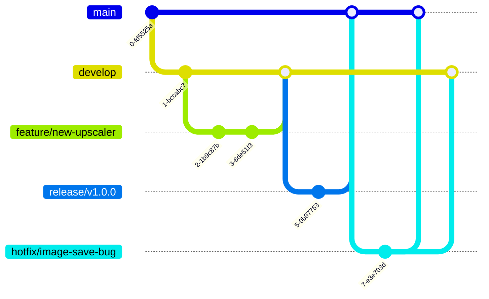
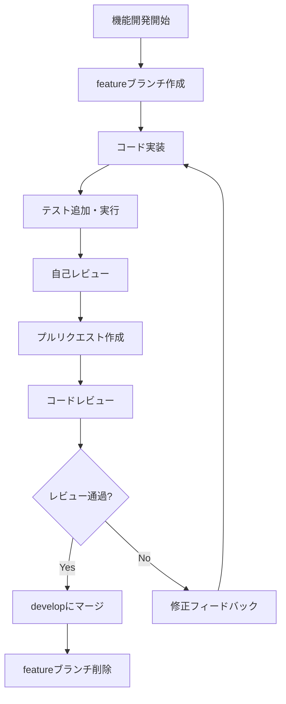

# 開発貢献ガイドライン

GenerativeAIArtWebプロジェクトへの貢献をご検討いただきありがとうございます。このドキュメントでは、プロジェクトに貢献するための主要なガイドラインを説明します。

## コード規約

### 命名規則

- **ファイル名**: スネークケース（`file_manager.py`, `prompt_generator.py`）
- **クラス名**: パスカルケース（`FileManager`, `PromptGenerator`）
- **関数・メソッド名**: スネークケース（`load_model()`, `generate_image()`）
- **変数名**: スネークケース（`model_path`, `image_output`）
- **定数**: 大文字のスネークケース（`MAX_RESOLUTION`, `DEFAULT_STEPS`）

### コードスタイル

- **PEP 8**: Pythonコードは[PEP 8](https://www.python.org/dev/peps/pep-0008/)に準拠すること
- **型ヒント**: 関数やメソッドの引数と戻り値には適切な型ヒントを含めること
- **ドキュメント文字列**: すべての関数、クラス、メソッドにドキュメント文字列を記述すること

```python
def generate_image(
    prompt: str, 
    steps: int = 40, 
    cfg_scale: float = 4.5
) -> tuple[Image.Image, str]:
    """画像を生成する

    Args:
        prompt (str): 生成プロンプト
        steps (int, optional): 生成ステップ数. デフォルトは40.
        cfg_scale (float, optional): CFGスケール. デフォルトは4.5.

    Returns:
        tuple[Image.Image, str]: 生成された画像とステータスメッセージ
    """
    # 実装
```

### コード品質

- **Mypy**: 静的型チェックには`mypy`を使用
- **Flake8**: コードスタイルチェックには`flake8`を使用
- **重複の回避**: DRY（Don't Repeat Yourself）原則に従ってコードの重複を避ける
- **テスト**: 新機能や変更には必ずテストを追加する

## ブランチ戦略

GitFlowに基づくブランチ戦略を採用しています：



### ブランチ種類

- **main**: 本番環境用の安定版コード
- **develop**: 開発中の最新コード
- **feature/xxx**: 新機能開発用（例: `feature/watermark-feature`）
- **bugfix/xxx**: バグ修正用（例: `bugfix/memory-leak`）
- **release/x.x.x**: リリース準備用（例: `release/1.2.0`）
- **hotfix/xxx**: 緊急のバグ修正用（例: `hotfix/critical-error`）

### コミットメッセージ規約

コミットメッセージは以下の形式に従ってください：

```
[種類]: 変更内容の簡潔な説明 (50文字以内)

変更の詳細な説明 (オプション、72文字以内の行)
```

種類の例:
- **feat**: 新機能
- **fix**: バグ修正
- **docs**: ドキュメントのみの変更
- **style**: コードの意味に影響しない変更（フォーマットなど）
- **refactor**: バグ修正や機能追加を伴わないコード変更
- **perf**: パフォーマンス向上のためのコード変更
- **test**: テストの追加・修正
- **chore**: ビルドプロセスやツールの変更

例:
```
feat: 画像生成時のプログレスバー表示を追加

- 生成ステップごとに進捗率を表示
- キャンセル機能を追加
- プレビュー画像の表示を追加
```

## プルリクエストプロセス



### プルリクエスト作成のステップ

1. 最新の`develop`ブランチから新しいブランチを作成
2. 変更を実装し、適切なテストを追加
3. コミット前に自動テストが通ることを確認
4. プルリクエストを作成し、変更内容を明確に説明
5. レビュアーを指定し、レビュー依頼

### プルリクエストテンプレート

```markdown
## 変更内容
変更の概要と目的を簡潔に説明してください。

## 関連する課題
関連するIssue番号（例: #123）

## 変更種類
- [ ] バグ修正
- [ ] 新機能
- [ ] ドキュメント更新
- [ ] パフォーマンス改善
- [ ] リファクタリング
- [ ] テストの追加・修正
- [ ] その他

## チェックリスト
- [ ] 自動テストを追加・修正した
- [ ] すべてのテストが通過する
- [ ] ドキュメントを更新した
- [ ] コードスタイルガイドラインに従っている
- [ ] 型チェックが通過している
```

## 開発ワークフロー

### 1. 課題の作成・選択

1. 新しい機能やバグ修正はまずIssueとして作成
2. 優先度、難易度、期限を設定
3. 担当者をアサイン

### 2. 開発環境のセットアップ

1. リポジトリをフォークまたはクローン
2. [DEVELOPMENT_SETUP.md](DEVELOPMENT_SETUP.md)の手順に従って環境をセットアップ
3. 必要なモデルファイルを準備

### 3. 実装

1. 適切なブランチを作成
2. コードを実装
3. 単体テストを追加
4. 変更がスタイルガイドとテストに合格することを確認

### 4. レビューとマージ

1. プルリクエストを作成
2. コードレビューを受け、フィードバックに対応
3. 承認後、適切なブランチにマージ

## テスト戦略

### 自動テスト

- **単体テスト**: 個々の関数やクラスの動作をテスト
- **統合テスト**: コンポーネント間の相互作用をテスト
- **エンドツーエンドテスト**: ユーザーフローをシミュレートしたテスト

### テスト実行

```bash
# すべてのテストを実行
poetry run pytest

# 特定のテストファイルを実行
poetry run pytest tests/generator/test_sd3_inf.py

# カバレッジレポート付きでテスト実行
poetry run pytest --cov=src
```

## ドキュメント

コードの変更には適切なドキュメント更新が必要です：

1. **コード内ドキュメント**: ドキュメント文字列、コメント
2. **ユーザードキュメント**: README.mdや関連ドキュメントの更新
3. **開発者ドキュメント**: ARCHITECTURE.md、DEVELOPMENT_SETUP.mdなどの更新

## その他のガイドライン

- **依存関係の追加**: 新しい依存関係を追加する場合は、必ず理由を説明し、プロジェクトに与える影響を検討してください。
- **パフォーマンス**: 画像生成などの時間のかかる処理は非同期で行い、UIの応答性を維持してください。
- **エラー処理**: エラーは適切に捕捉し、ユーザーに分かりやすいメッセージを表示してください。
- **セキュリティ**: ユーザーデータやモデルファイルの取り扱いには十分注意してください。

## 質問やヘルプ

質問や助けが必要な場合は、以下の方法でコンタクトしてください：

- Issueを作成する
- プロジェクトのコントリビューターに直接連絡する
- プロジェクトのディスカッショングループに参加する