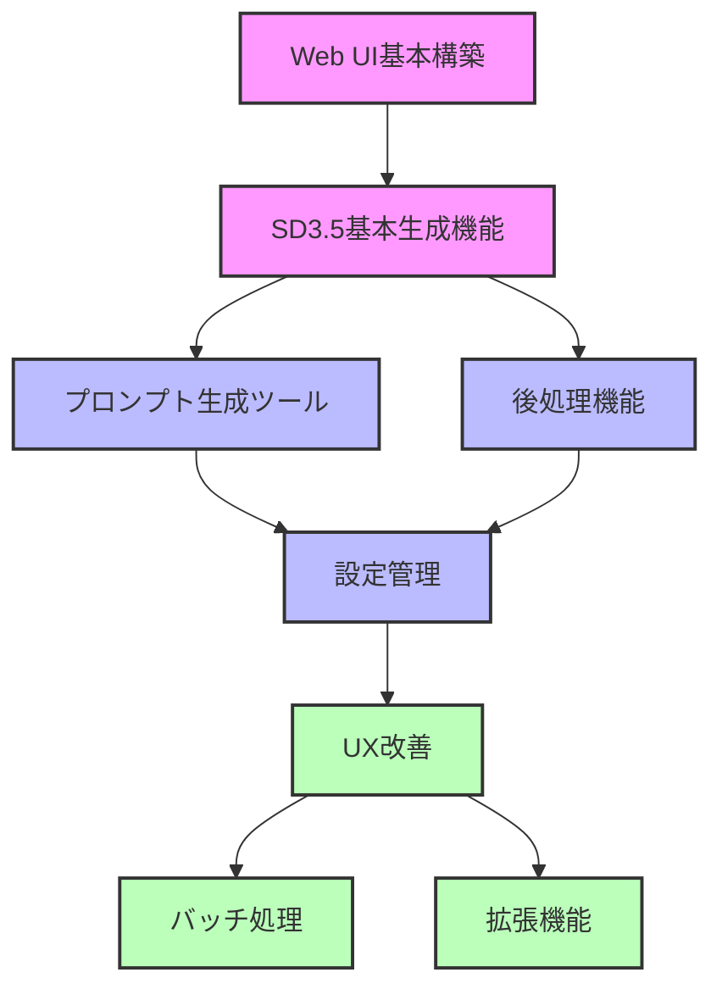

# プロダクト要求仕様書 (PRD)

## 製品概要

GenerativeAIArtWebは、最新のStable Diffusion 3.5モデルを活用して、テキストプロンプトから高品質な画像を生成するWebアプリケーションです。ユーザーフレンドリーなインターフェースを通じて、AIアートの生成、カスタマイズ、保存を可能にし、クリエイティブな表現を支援します。

### ビジョン

Stable Diffusion 3.5の高度な機能を一般ユーザーでも簡単に扱えるようにし、AIを活用したクリエイティブな表現の可能性を広げることを目指します。プロンプトエンジニアリングの複雑さを軽減し、高品質な画像生成と後処理機能を統合したオールインワンソリューションとして提供します。

### 対象ユーザー

1. **クリエイティブアーティスト**: イラストや概念デザインのアイデア出しに活用
2. **コンテンツクリエイター**: ブログ、SNS、メディア用の独自ビジュアルの作成
3. **AI技術愛好家**: 最新のAIモデルを手軽に試したいユーザー
4. **デザイナー**: デザイン案や素材のプロトタイピング
5. **教育者**: AIアートの可能性を示す教育ツールとして

## 機能要件

### 1. Webインターフェース

#### 必須機能 (Must-have)
- Gradioを使用した直感的なWebUIの提供
- レスポンシブデザインによるモバイル対応
- 生成パラメータの調整機能
- 生成履歴の表示と再利用

#### 望ましい機能 (Nice-to-have)
- テーマ切り替え（ライト/ダーク）
- 多言語対応
- ショートカットキー
- ドラッグ&ドロップ操作

### 2. 画像生成エンジン

#### 必須機能 (Must-have)
- SD3.5モデルを使用した高品質画像生成
- 複数のサンプラーのサポート（euler, dpmpp_2m）
- 進捗状況の表示
- シード値管理（再現性の確保）

#### 望ましい機能 (Nice-to-have)
- 複数モデルの切り替え
- バッチ処理による複数画像の同時生成
- 中間プレビューの表示
- 生成プロセスのキャンセル機能

### 3. プロンプト生成ツール

#### 必須機能 (Must-have)
- LLMを使用した自動プロンプト生成
- JSONテンプレートベースのプロンプト構築
- 生成されたプロンプトの編集機能
- スタイルやモードの選択

#### 望ましい機能 (Nice-to-have)
- プロンプトの履歴管理
- カスタムプロンプトテンプレートの作成
- プロンプト要素の重み付け編集
- ネガティブプロンプトの管理

### 4. 後処理機能

#### 必須機能 (Must-have)
- 画像のアップスケール（最大4倍）
- ウォーターマーク追加
- カスタムファイル保存パス
- メタデータの保存

#### 望ましい機能 (Nice-to-have)
- 画像のトリミングと回転
- カラー調整
- フィルター適用
- バッチ処理

### 5. 設定管理

#### 必須機能 (Must-have)
- ユーザー設定のプロファイル保存
- 設定のインポート/エクスポート
- デフォルト出力パスの設定
- 生成パラメータのプリセット

#### 望ましい機能 (Nice-to-have)
- クラウド同期
- 設定の自動バックアップ
- ユーザーごとの設定プロファイル
- APIインテグレーション

## 非機能要件

### 1. パフォーマンス

- 画像生成は一般的なGPU（VRAM 8GB以上）で実行可能であること
- UIの応答は常に0.5秒以内であること
- 1024×1024画像の生成は、標準的なGPUで3分以内に完了すること
- 同時に最大5ユーザーのリクエストを処理できること

### 2. 使いやすさ

- 初心者ユーザーが5分以内に操作方法を理解できること
- 主要機能が3クリック以内で到達可能であること
- エラーメッセージは明確かつ対処法が理解できること
- ツールチップとヘルプ情報を提供すること

### 3. 信頼性

- 一般的な動作環境で99%以上の稼働率を実現すること
- エラー発生時も適切に回復できること
- 長時間実行時のメモリリークがないこと
- セッション情報を保持し、ブラウザ再読み込み後も状態を復元できること

### 4. セキュリティ

- 生成画像とメタデータはローカルにのみ保存されること
- ユーザーデータは外部サービスに送信されないこと
- 設定ファイルのアクセス制限
- モデルファイルの整合性チェック

### 5. 保守性

- モジュール化された設計による機能の分離
- 一貫したコード規約の適用
- 詳細なログ記録
- 拡張性を考慮した設計

## ユーザーシナリオ

### シナリオ1: ファーストタイム体験

```
ユーザーのアクション:
1. アプリケーションを初めて起動
2. サンプルプロンプトを選択
3. デフォルト設定で生成ボタンをクリック
4. 生成結果を確認

システムの応答:
1. 初回起動ガイドを表示
2. サンプルプロンプトをプロンプト入力欄に自動挿入
3. 生成進捗状況をプログレスバーで表示
4. 生成完了後、画像を表示し、利用可能な後処理オプションを案内
```

### シナリオ2: プロンプト生成機能の活用

```
ユーザーのアクション:
1. プロンプト生成タブに移動
2. 基本的なアイデア「山の風景」を入力
3. LLMプロンプト生成を選択
4. 生成されたプロンプトを調整
5. 画像生成タブに移動して生成実行

システムの応答:
1. プロンプト生成インターフェースを表示
2. LLMにプロンプト生成をリクエスト
3. 詳細なプロンプトを生成して表示
4. 編集後のプロンプトを自動的に画像生成タブに適用
5. 生成処理を実行
```

### シナリオ3: 生成画像の後処理と保存

```
ユーザーのアクション:
1. 生成された画像を確認
2. アップスケールオプションを選択
3. 2倍の解像度に設定
4. ウォーターマークを追加
5. カスタム保存場所を指定して保存

システムの応答:
1. 生成画像を表示
2. アップスケール設定を提示
3. アップスケール処理を実行し、高解像度画像を表示
4. ウォーターマーク設定を提示し、適用
5. 指定場所に画像とメタデータを保存し、完了通知
```

## 技術的実装の優先順位



## 成功指標

### 定量的指標
- **生成画質評価**: FID/CLIP-Scoreによるベースラインモデルとの比較（最低でも同等以上）
- **レスポンス時間**: UI操作からの応答が90%以上のケースで0.5秒以内
- **エラー率**: 一般的な使用シナリオでのエラー発生率1%未満
- **学習曲線**: 新規ユーザーが基本機能をマスターするのに必要な時間（目標：5分以内）

### 定性的指標
- **ユーザー満足度**: アプリケーション内フィードバックでの評価
- **プロンプト品質**: 生成支援ツールによるプロンプトの有効性
- **出力の多様性**: 同じプロンプトでも多様な表現が可能か
- **ワークフロー効率**: 一連の操作がスムーズに完了できるか

## テスト計画

1. **ユニットテスト**: 各コンポーネントの機能検証
2. **統合テスト**: コンポーネント間の相互作用検証
3. **パフォーマンステスト**: 処理速度と資源使用効率の検証
4. **ユーザビリティテスト**: 実際のユーザーによる操作性検証
5. **クロスプラットフォームテスト**: 異なるOSとブラウザでの動作確認

## ロードマップ

### フェーズ1: 基本機能実装（2ヶ月）
- Gradio UIの基本構築
- SD3.5モデルの統合
- 基本的な生成パラメータの実装
- シンプルなファイル保存機能

### フェーズ2: 機能拡張（3ヶ月）
- LLMとJSONベースのプロンプト生成
- アップスケールとウォーターマーク機能
- 設定管理システム
- 生成履歴とプリセット

### フェーズ3: 洗練と最適化（2ヶ月）
- UIの洗練とモバイル対応
- バッチ処理機能
- パフォーマンス最適化
- ドキュメント充実

### 将来の拡張
- ControlNetサポート
- インペインティング機能
- 様々なモデルのプラグイン対応
- 外部サービス連携